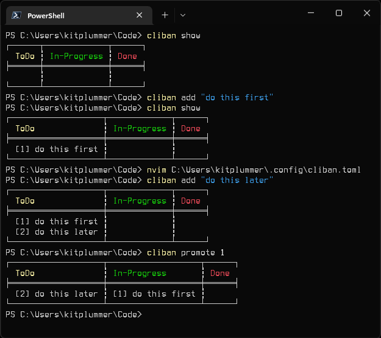

# cliban

Personal kanban in the terminal/CLI.

refactor of https://github.com/kitplummer/clikan in Rust for portability

There has been a little chatter about 'personal' kanban on the tubes lately.  I don't know about the need to hype it as personal, but if you're looking to get your head wrapped around stuff needing to get done - then kanban is a healthy tool.  cliban is a super simple command-line utility for tracking tasks following the Japanese Kanban (boarding) style.  cliban's core intent is to be easy to use, and to maintain simplicity.


## using

### configure

$ `cliban configure` will drop a basic config file in `$HOME/.config/cliban.toml`

It'll contain something that looks like this:
```
cliban_data = "C:\\Users\\kitplummer\\.cliban.json"
repaint = true
```

`cliban_data` is the location of the tools data
`repaint` is a configuration telling the tool to `show` the table after each command (default is `false`)

The basic usage of `cliban` breaks down into three basic commands:

### show

$ `cliban show`

### add

$ `cliban add [task text]`

### promote

$ `cliban promote [task id]`

And there are more supporting commands:

### regress

$ `cliban regress [task id]`

### delete

$ `cliban delete [task id]`

### configure

$ `cliban configure`

## screenshot


## todo

lots!

* use --config override
* column limits (e.g., max 3 tasks in-progress)
* validate config
* release process (including installables for package managers - e.g., winget, homebrew, etc.)

## development, testing and contributing

### depends on

Rust :)
comfy-table -> https://github.com/Nukesor/comfy-table
### objectives

* trying to support Windows, macOS, and Linux distributions
* automate all the delivery bits
* functional tests for everything

### dev env

* build debug version -> `cargo build`
* build release version -> `cargo build --release`
* test -> `cargo test`


## license

MIT - https://mit-license.org

```
Copyright © 2022 <Kit Plummer>

Permission is hereby granted, free of charge, to any person obtaining a copy of this software and associated documentation files (the “Software”), to deal in the Software without restriction, including without limitation the rights to use, copy, modify, merge, publish, distribute, sublicense, and/or sell copies of the Software, and to permit persons to whom the Software is furnished to do so, subject to the following conditions:

The above copyright notice and this permission notice shall be included in all copies or substantial portions of the Software.

THE SOFTWARE IS PROVIDED “AS IS”, WITHOUT WARRANTY OF ANY KIND, EXPRESS OR IMPLIED, INCLUDING BUT NOT LIMITED TO THE WARRANTIES OF MERCHANTABILITY, FITNESS FOR A PARTICULAR PURPOSE AND NONINFRINGEMENT. IN NO EVENT SHALL THE AUTHORS OR COPYRIGHT HOLDERS BE LIABLE FOR ANY CLAIM, DAMAGES OR OTHER LIABILITY, WHETHER IN AN ACTION OF CONTRACT, TORT OR OTHERWISE, ARISING FROM, OUT OF OR IN CONNECTION WITH THE SOFTWARE OR THE USE OR OTHER DEALINGS IN THE SOFTWARE.
```

